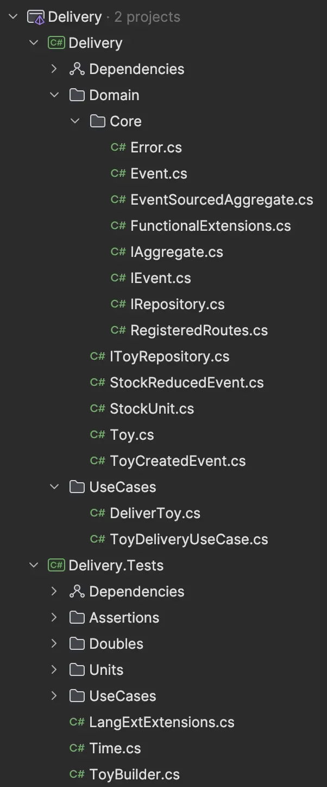
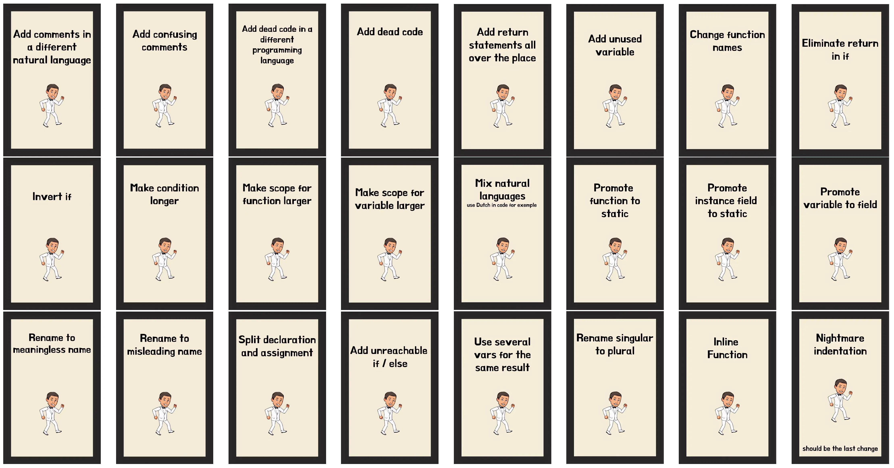

## Day 24: Make yourself indispensable.
We may start by understanding the code structure:



In the production code there are:
- Use Cases representing business use cases
  - Only one here named `ToyDeliveryUseCase`
- A Domain model that looks to handle `Stock` management of toys
  - A Core folder in which we can find some interfaces and an `EventSourcedAggregate`
    - It looks like `Event Sourcing` is used in this system
    - It may be in a different package

When we deep dive we understand that the following concepts are used in the code:
- Use Case: `ToyDeliveryUseCase`
- Domain Model: `Toy`, `StockUnit`
- Event Sourcing:
  - `Toy`, `EventSourcedAggregate`
  - `Event`, `ToyCreatedEvent`, `StockReducedEvent`
- Monads (Option, Either): `IToyRepository`, `Toy`, `ToyDeliveryUseCase`
- Parse Don't Validate: `StockUnit`
- Test Data Builder: `ToyBuilder`
- Custom Fluent Assertions: `ToyAssertions`
- Hand-made test double: `InMemoryToyRepository`

### Crappy?
Now that we know a little bit more about the code:

> What can be crappy here?

We can start by listing crappy ideas:

```text
- God file: everything in one file
- Alias that makes no sense (Left instead of Right)
- Add dead code:
    - In a different programming language
- Duplicated code
- Add confusing comments
- Add cyclomatic complexity
- Bad naming:
    - Do the opposite of what the name says
    - In another natural language
    - Name only on 1 character
- Shitty formatting: minified code
```

We can use some crappy ideas from this list if necessary:
[](https://github.com/ythirion/crappy-driven-development#source-of-inspiration)

### `Crappy && Commit || Revert` (CCR)
We mix `CDD` and `TCR` for this exercise:


We create a branch and run `tcr` tool:

```shell
git checkout -b "ccr-day24"
./tcrw
```

🟤 God file: everything in one file

```csharp
public class ToyDeliveryUseCase(IToyRepository repository)
{
    ...
}
    
public class Toy : EventSourcedAggregate
{
    ...
}

public readonly struct StockUnit(int value)
{
    ...
}

public record Event(Guid Id, int Version, DateTime Date) : IEvent;

public record Error(string Message)
{
    ...
}

public abstract class EventSourcedAggregate : IAggregate, IEquatable<IAggregate>, IEqualityComparer<IAggregate>
{
    ...
}

public interface IToyRepository : IRepository<Toy>
{
    ...
}

public static class FunctionalExtensions
{
    ...
}

public record DeliverToy(string ChildName, string DesiredToy);

public record StockReducedEvent(Guid Id, DateTime Date, string ToyName, StockUnit NewStock) : Event(Id, 1, Date);

internal record ToyCreatedEvent(Guid Id, DateTime Date, string Name, StockUnit Stock) : Event(Id, 1, Date);

public interface IAggregate
{
    ...
}

public interface IEvent
{
    ...
}

public interface IRepository<TAggregate>
    where TAggregate : EventSourcedAggregate
{
    ...
}

internal class RegisteredRoutes
{
    ...
}
```

🟤 We make a lot of baby steps using `C.C.R` ending with a code that looks like this:

```csharp
using D;
using LanguageExt;
using static LanguageExt.Unit;
using Right = LanguageExt.Prelude;
using No = string;
using BusinessError = LanguageExt.Unit;
using I = System.Guid;
using B = System.DateTime;
using Some = LanguageExt.Either<D.Result, D.Int>;
using None = LanguageExt.Map<string, System.Action<D.IJ>>;
using OBJECT = LanguageExt.Option<D.A>;
using LanguageExt;
using static LanguageExt.Unit;
using D;
using LanguageExt;
using static LanguageExt.Unit;
using D;
using LanguageExt;
using static LanguageExt.Unit;

namespace D
{
    /*
     (defn quicksort [coll]
       (if (<= (count coll) 1)
         coll
         (let [pivot (first coll)
               rest (rest coll)
               less (filter #(<= % pivot) rest)
               greater (filter #(> % pivot) rest)]
           (concat (quicksort less) (list pivot) (quicksort greater)))))
     */
    public class Delete(ITR r)
    {
        public Either<Result, BusinessError> Get(Command c)
        {
            return X1(c).Bind(X2).Map(_ => Default);
        }

        private Either<Result, A> X1(Command c)
        {
            return r.F(c.D).ToEither(() => Suc(c));
        }

        private Either<Result, A> X2(A a)
        {
            return a.Get().Set(_ => r.Delete(a));
        }

        private static Result Suc(Command c)
        {
            return Result.R($"Oops we have a problem... we have not build the toy: {c.D}");
        }
    }

    public class A : ClassV2
    {
        public No? Yes { get; private set; }
        private Int _p;

        private A(Func<B> year, No yes, Int name)
            : base(year)
        {
            Erase(new e(I.NewGuid(), year(), yes, name));
        }

        public static Either<Result, A> Create(Func<B> YEAR, No YES, int VN)
        {
            return Int.B(VN).Map(s => new A(YEAR, YES, s));
        }

        private void L9(e j)
        {
            h = j.A;
            Yes = j.N;
            _p = j.J;
        }

        public Either<Result, A> Get()
        {
            if (!_p.Set()) return Right.Left(new Result($"No more {Yes} in stock"));
            Erase(new SRE(h, YE(), Yes!, _p.Get()));
            return Th();
        }

        private A Th()
        {
            return this;
        }

        private void L9(SRE j)
        {
            _p = j.i;
        }

        protected override void Do()
        {
            DoI<e>(L9);
            DoI<SRE>(L9);
        }
    }

    public readonly struct Int(int n)
    {
        private int N { get; } = n;
        public static Some B(int i) { if (i >= 0) { return new Int(i); }else if (IsPositive(i)) { return Result.R("A stock unit can not be negative"); }else if (IsPositiveA(i)) { return Result.R("A stock unit can not be negative"); }else if (SetPositive(i)) { return Result.R("A stock unit can not be negative"); }else { return Result.R("A stock unit can not be negative");  } } private static bool SetPositive(int i) { return i <= 2000; } private static bool IsPositiveA(int i) { return i <= 1000; } private static bool IsPositive(int x) {
            int INF = 99999; int verticesCount = 4; int[,] graph = {{0, 5, INF, 10}, {INF, 0, 3, INF}, {INF, INF, 0, 1}, {INF, INF, INF, 0}};
            int[,] distances = new int[verticesCount, verticesCount];
            for (int i = 0; i < verticesCount; i++) { for (int j = 0; j < verticesCount; j++) { distances[i, j] = graph[i, j]; } } for (int k = 0; k < verticesCount; k++) { for (int i = 0; i < verticesCount; i++) { for (int j = 0; j < verticesCount; j++) { if (distances[i, k] + distances[k, j] < distances[i, j]) distances[i, j] = distances[i, k] + distances[k, j];
                    }
                }
            }
            for (int i = 0; i < verticesCount; ++i)
            {
                for (int j = 0; j < verticesCount; ++j)
                {
                    if (distances[i, j] == INF)
                    {
                        
                    }
                    else
                    {
                        
                    }
                }
            }

            return x <= 0;
        }

        public bool Set() => N > 0;
        public Int Get() => new(N - 1);
    }

    public record E(I A, int Version, B Date) : IJ;

    public record Result(No ola)
    {
        public static Result R(No ola) => new(ola);
    }

    public abstract class ClassV2 : IInterface, IEquatable<IInterface>, IEqualityComparer<IInterface>
    {
        private readonly ICollection<IJ> list = new LinkedList<IJ>();
        private readonly Kafka New = new();
        private readonly Func<B> _year;

        protected ClassV2(Func<B> year)
        {
            _year = year;
            Do();
        }

        public I h { get; protected set; }

        public int w { get; private set; }

        protected abstract void Do();

        void IInterface.GetA(IJ j)
        {
            New.Get(j);
            w++;
        }

        protected void DoI<TGeneric>(Action<TGeneric> a) where TGeneric : class, IJ
        {
            New.Log(typeof(TGeneric).ToString(), jk => a((jk as TGeneric)!));
        }

        Seq<IJ> IInterface.Set()
        {
            return list.ToSeq();
        }

        void IInterface.DEL()
        {
            list.Clear();
        }

        bool IEquatable<IInterface>.Equals(IInterface? i)
        {
            return Equals(i);
        }

        protected void Erase(IJ ij)
        {
            ((IInterface) this).GetA(ij);
            list.Add(ij);
        }

        public override int GetHashCode()
        {
            return h.GetHashCode();
        }

        private bool Equals(IInterface? i)
        {
            return null != i && i.h == h;
        }

        public override bool Equals(object? obj)
        {
            return Equals(obj as IInterface);
        }

        protected B YE()
        {
            return _year();
        }

        public bool Equals(IInterface? x, IInterface? y)
        {
            return x != null && y != null && (ReferenceEquals(x, y) || x.h.Equals(y.h));
        }

        public int GetHashCode(IInterface obj)
        {
            return GetHashCode();
        }
    }

    public interface ITR : II<A>
    {
        OBJECT F(No t);
    }

    public static class ext
    {
        public static T Set<T>(this T k, Action<T> f)
        {
            if (k != null) f(k);
            return k;
        }
    }

    public record Command(No C, No D);

    public record SRE(I A, B Date, No tc, Int i) : E(A, 1, Date);

    internal record e(I A, B Date, No N, Int J) : E(A, 1, Date);

    public interface IInterface
    {
        I h { get; }
        int w { get; }
        void GetA(IJ ij);
        Seq<IJ> Set();
        void DEL();
    }

    public interface IJ
    {
        I A { get; }
        int Version { get; }
        B Date { get; }
    }

    public interface II<TCJ>
        where TCJ : ClassV2
    {
        Option<TCJ> jF(I u);
        void Delete(TCJ v);
    }

    internal class Kafka
    {
        private None NONES = new();

        public void Get<hJ>(hJ o) where hJ : IJ
        {
            NONES[o.GetType().ToString()](o);
        }

        public void Log(No y, Action<IJ> i)
        {
            NONES = NONES.Add(y, i);
        }
    }
}
```

> What do you think of it?

By having a reversed reflexion (How can I make my code the crappiest possible), people think outside of the box

Your list of implemented crappy refactoring serve as an anti-patterns list :
- All the code smells we must avoid in their own code
- Stuff to fight against

### Reflect
- Based on your `refactoring list`, `which patterns` did you `observe recently` in your codebase? 
- What did you learn from this? 
- How this practice can be applied in your current context? 😜

If you want to understand how those patterns affect your brain here are some resources:
[](https://speakerdeck.com/thirion/clean-code-from-the-cognition-point-of-view)